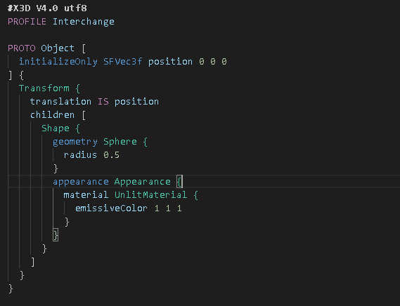
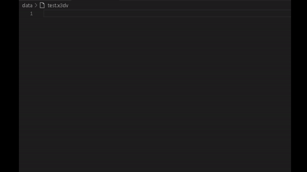

# X3D file format editing tool

This is a VSCode extension for editing X3D in classic encoding.
The tool follows Castle Game Engine's specification, include all X3D standard supported by Castle Game Engine, and Castle Game Engine's own X3D extensions.

## Features
- Syntax highlight
- Snippets

